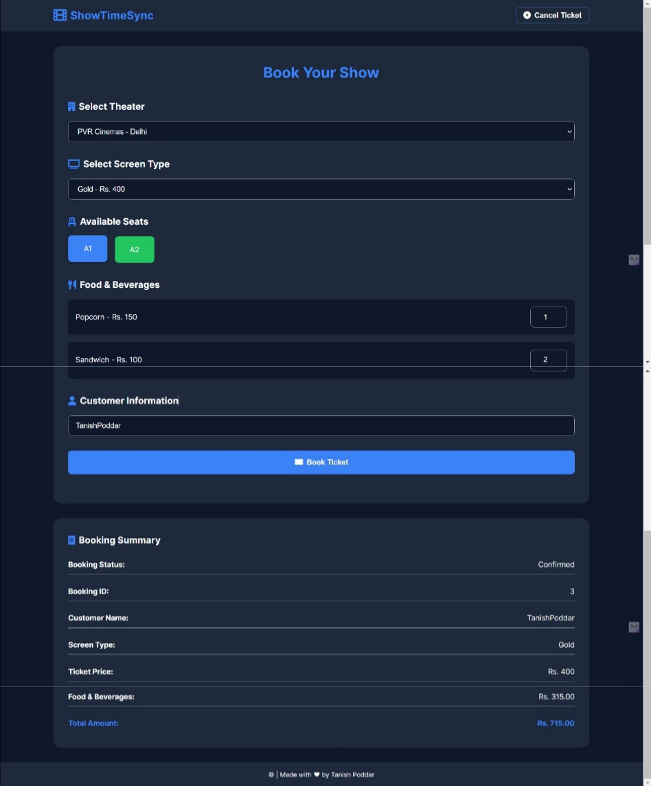

# ShowTimeSync - Node.js

This is a movie booking application built using Node.js and SQLite. It provides a simple web interface for users to book movie tickets.

## Getting Started
To get started with the project, follow these steps:

1. **Clone the Repository:**
   ```sh
   git clone https://github.com/tanishpoddar/ShowTimeSync
   cd movie-booking-app
   cd fullstack-app
   ```

2. **Install Dependencies:**
   ```sh
   npm install
   ```

3. **Install Other Dependencies:**
   ```sh
   pip install -r requirements.txt
   ```

3. **Initialize the Database:**
   ```sh
   node init-db.js
   ```

4. **Run the Application:**
   ```sh
   node app.js
   ```

5. **Open the Web Interface:**
   Open your browser and navigate to `http://localhost:3001`.

## Project Structure
- `app.js`: Main application file.
- `cleanup-db.js`: Script for cleaning up the database.
- `init-db.js`: Script for initializing the database.
- `init.sql`: SQL script for initializing the database schema.
- `movie_booking.db`: SQLite database file.
- `public/`: Directory containing static files for the web application.
  - `index.html`: Main HTML file.
  - `css/`: Directory for CSS files.
    - `styles.css`: Main CSS file.
  - `js/`: Directory for JavaScript files.
    - `main.js`: Main JavaScript file.

## Database Setup
The database is initialized using the `init.sql` script and the `init-db.js` script. The `cleanup-db.js` script can be used to clean up the database if needed.

## Running the Application
To run the application, use the following command:
```sh
node app.js
```
The application will start a server on `http://localhost:3001`.

## Screenshots

## Contributing
Contributions are welcome! Please open an issue or submit a pull request if you have any improvements or fixes.

## License
This project is licensed under the MIT License. See the [LICENSE](LICENSE) file for details.